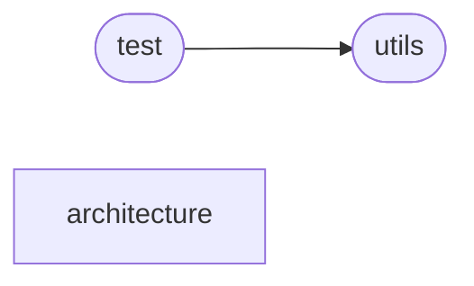

# Code Overview

[_Documentation generated by Documatic_](https://www.documatic.com)

<!---Documatic-section-Codebase Structure Python-start--->
## Codebase Structure Python

The codebase has a single-depth folder structure,
                with 13 code files in total.

<!---Documatic-block-system_architecture-start--->

<!---Documatic-block-system_architecture-end--->

# #
<!---Documatic-section-Codebase Structure Python-end--->

<!---Documatic-section-Important Functions-start--->
## Important Functions

<!---Documatic-block-important_funcs-start--->
<!---Documatic-block-most_used_funcs-start--->
### Most Utilised Functions

* predict_code.utils.save_matv73 (1 times)
<!---Documatic-block-most_used_funcs-end--->
<!---Documatic-block-important_funcs-end--->

# #
<!---Documatic-section-Important Functions-end--->

<!---Documatic-section-Class Hierarchy-start--->
## Class Hierarchy

<!---Documatic-block-nn.Module-start--->

	
<code>nn.Module</code> (Click to Expand!)

* predict_code.architecture.Restormer.BiasFree_LayerNorm
* predict_code.architecture.Restormer.FeedForward
* predict_code.architecture.Restormer.LayerNorm
* predict_code.architecture.Restormer.WithBias_LayerNorm
* predict_code.architecture.hinet.HINet
* predict_code.architecture.hinet.SAM
* predict_code.architecture.hinet.Subspace
* predict_code.architecture.hinet.UNetConvBlock
* predict_code.architecture.hinet.UNetUpBlock
* predict_code.architecture.hinet.skip_blocks

<!---Documatic-block-nn.Module-end--->

# #
<!---Documatic-section-Class Hierarchy-end--->

[_Documentation generated by Documatic_](https://www.documatic.com)